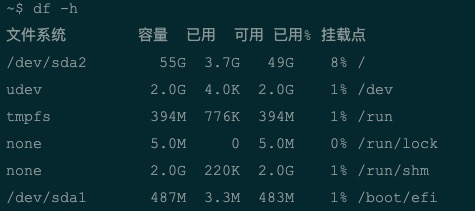
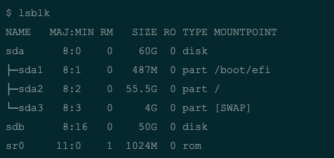
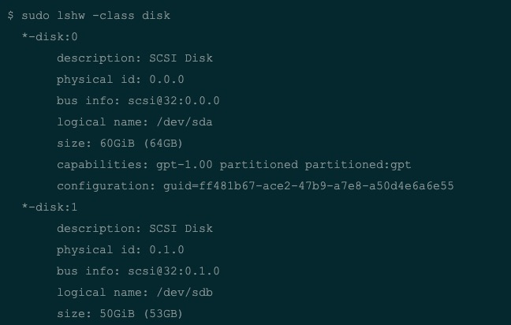
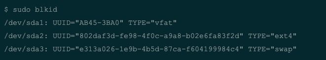
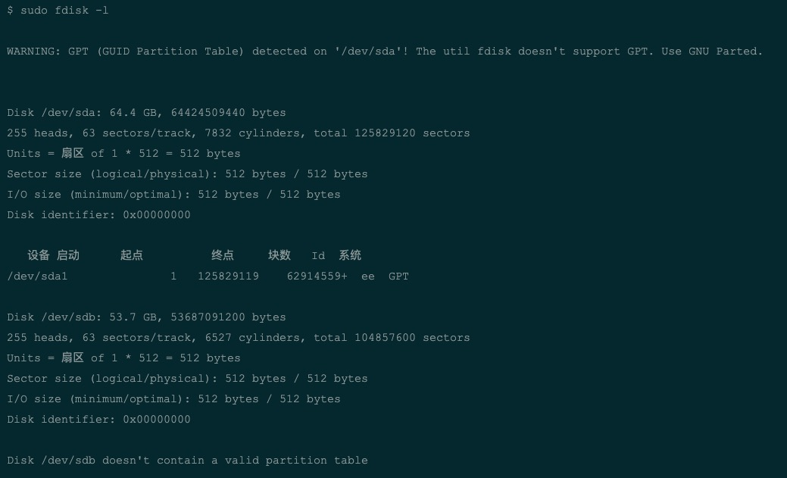
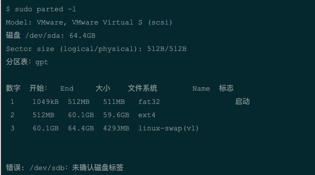
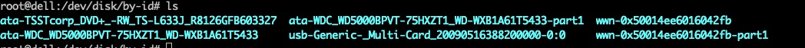
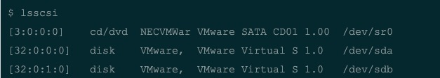
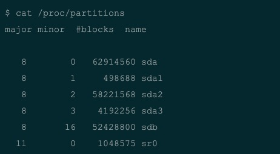

## Linux中查看硬盘信息

一台电脑中可以安装多块硬盘，如何查看所有的硬盘信息

### df

**df**命令用于查看服务器的磁盘使用情况，列出系统中挂在的硬盘，使用**-h**选项可以以人类可读的格式输出硬盘使用情况:



*df*命令无法显示未挂载的硬盘

### lsblk

**lsblk**命令查看服务器块设备及挂载点信息：



### lshw

**lshw**打印硬件的详细信息，**-class disk**参数可以制定打印磁盘的信息



## blkid

**blkid**命令查看服务器块设备及UUID信息：



## fdisk

**fdisk**用来格式化硬盘及分区的工具，也可以打印硬盘信息：



**fdisk 因为使用MRB分区方式，所以最大分区2T的存储，2T以上需要使用下面的parted分区工具**

## fsck

**fsck(file system check)**用来检查和维护不一致的文件系统，若系统掉电或磁盘发生问题，可利用fsck命令对文件系统进行检查。

```bash
语法：
fsck [-t 文件系统] [-ACay] 装置名称
选项与参数：
-t : 给定档案系统的型式，若在 /etc/fstab 中已有定义或 kernel 本身已支援的则不需加上此参数
-s : 依序一个一个地执行 fsck 的指令来检查
-A : 对/etc/fstab 中所有列出来的 分区（partition）做检查
-C : 显示完整的检查进度
-d : 打印出 e2fsck 的 debug 结果
-p : 同时有 -A 条件时，同时有多个 fsck 的检查一起执行
-R : 同时有 -A 条件时，省略 / 不检查
-V : 详细显示模式
-a : 如果检查有错则自动修复
-r : 如果检查有错则由使用者回答是否修复
-y : 选项指定检测每个文件是自动输入yes，在不确定那些是不正常的时候，可以执行 # fsck -y 全部检查修复。
-f : 强制检查，如果没有加上 -f 的选项，则由于这个文件系统不曾出现问题，检查的经过非常快速！若加上 -f 强制检查，才会一项一项的显示过程。
```

## parted

**parted**是一个分区操作工具，使用GPT分区



## /dev/disk/by-id/

**/dev/disk/by-id/**目录下是磁盘的id对应名称，比较固定



## lsscsi

**lsscsi**工具可以打印SCSI硬盘信息，这个工具在Ubuntu12.04中默认没有安装，需要自行安装：



### /proc/partitions

**/proc/partitions**文件可以查看当前硬盘及分区的一些信息：




## Linux 查看磁盘是SSD还是HDD的方法

1. `cat /sys/block/sdd/queue/rotational` 以sdd盘为例
2. `lsblk -d -o name,rota` 

以上两个方法输出结果如果为`1`，表示磁盘可以旋转，是机械磁盘 hdd；如果输出为`0`，表示磁盘不可旋转，为固体硬盘

## Linux系统下查看磁盘相关属性的工具，例如磁盘转速等信息

[sg3_utils](http://sg.danny.cz/sg/sg3_utils.html#__RefHeading___Toc611_3724309425)

**用例**

1. 查看系统磁盘对应sg3_utils映射：`sg_map`
2. 查看系统磁盘转速信息：`sg_vpd -a /dev/sg0`

## Inxi：一个可以获取完整的系统和硬件详情信息的命令行工具

内容包括:

1. 硬件
2. CPU
3. 磁盘驱动器
4. Xorg
5. 桌面环境
6. 内核
7. GCC版本
8. 进程
9. 内存占用
10. 和其他有用的信息

详情见 [Inxi](https://github.com/smxi/inxi)
基本介绍见 [简介](https://www.linuxprobe.com/inxi-access-linux.html)
