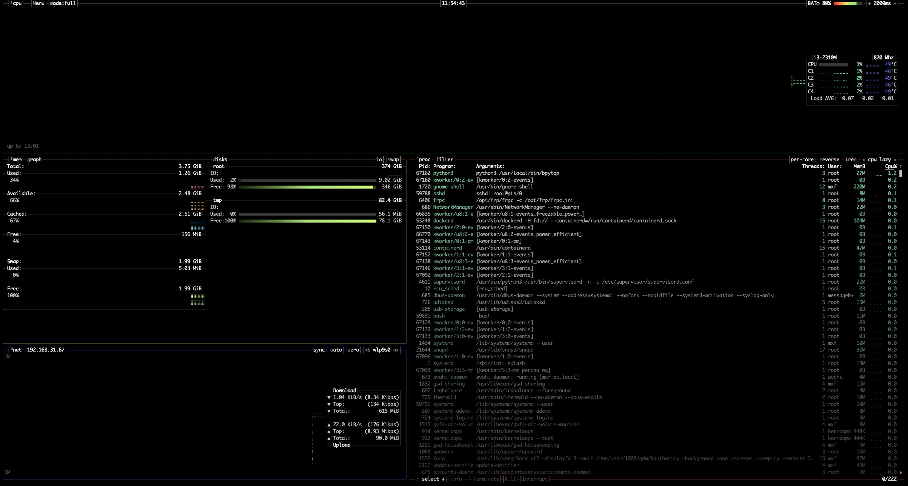

## Htop

## Bpytop - Linux中一个高效的资源监控器

[GitHub链接](https://github.com/aristocratos/bpytop)

>> Resource monitor that shows usage and stats for processor, memory, disks, network and processes.

### 效果



### 服务器安装（Ubuntu）

1. 导入源

```bash
echo "deb http://packages.azlux.fr/debian/ buster main" | sudo tee /etc/apt/sources.list.d/azlux.list
wget -qO - https://azlux.fr/repo.gpg.key | sudo apt-key add -
```

2. 安装

```bash
apt install bpytop
```

### Docker 镜像使用

```bash
docker run --rm -it --pid=host --net=host -v /data/bpytop:/root/.config/bpytop/ macgyverbass/bpytop
```
