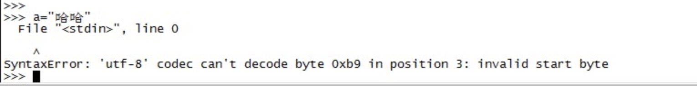
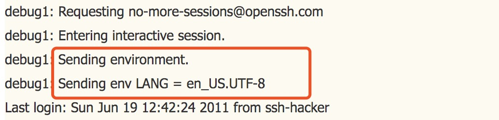

## SSH SendEnv && AcceptEnv

> openssh是常用的Linux服务器远程登录工具，有些时候远程到服务后执行远程脚本会出现依赖环境变量的一些错误，原因是环境变量跟原有的设置不一致，如下远程至服务器后，在python3交互模式下编码问题：   

  

> 出现该问题是因为ssh登录时传递了本地的环境变量设置到远程服务器上，导致远程服务器环境变量发生变化，可以通过ssh -v 看到，如下：

> 解决办法有三种

- 远程登录后执行 sudo -i xxx
- 修改本地ssh配置文件/etc/ssh/ssh_config，注释里面的SendEnv xxx配置
- 修改远程服务器配置文件/etc/ssh/sshd_config，注释里面的AcceptEnv xxx配置

